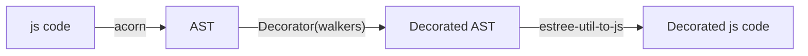

# Using-acorn-to-decorate-JS

This is an example of how to use acorn for adding start and stop nodes to JavaScript code, the start and stop nodes is intended to be calls for our rapl library.

Missing features:
- Handling return statements and throws



## How to use main
- ```npm install package.json```
- ```node main.js <your js file here>```